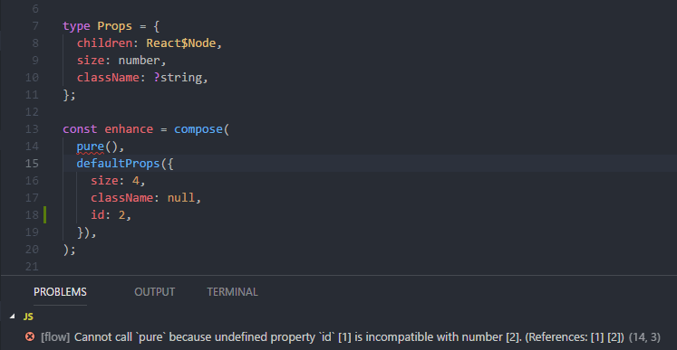
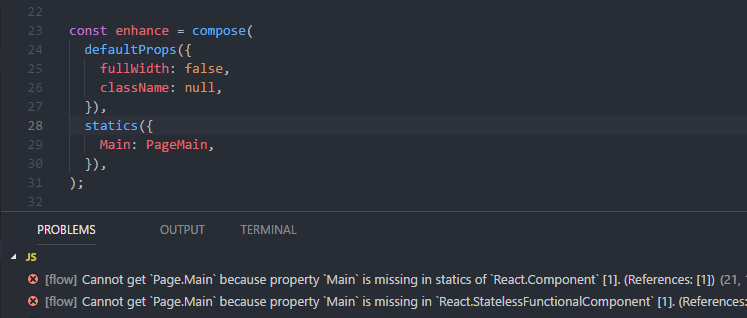

# Flow support

This package offers an [`index.js.flow`](../src/index.js.flow) file with Flow types. You can import them as a Flow library. If you have done this, you may have a look at the [Flow example](../examples/flow) for usage.

## Types of state helpers

If you include the Flow definitions of this package, you will be able to use `Extended$State<SubStateValues, SubStateMutators>` and `Extended$StateHelper<SubStateValues, SubStateMutators>`. See the [Flow example](../examples/flow) for usage.

## Troubleshooting

### 1) Inexact error message for missing prop

#### Error

#### Description

The error message says there is a problem with `pure`, which is not true. The problem is that id is not defined in type `Props`, but is defined in `defaultProps`.

#### Solution

If you cannot see an error in the referenced hoc, always check the `defaultProps` hoc for missing props and remove these props from `defaultProps` or add them to the type `Props`.

### 2) `defaultProps` used before `statics`

#### Error

#### Description

The error message says that there are no statics, which is not true. This is because currently the types of the statics are not copied over if you use `defaultProps` before `statics`.

#### Solution

If you use `defaultProps` after `statics` the error will disappear.

## Help wanted

If you are a Flow expert, feel free to contribute to the Flow types of this package and solve the problems described above.
